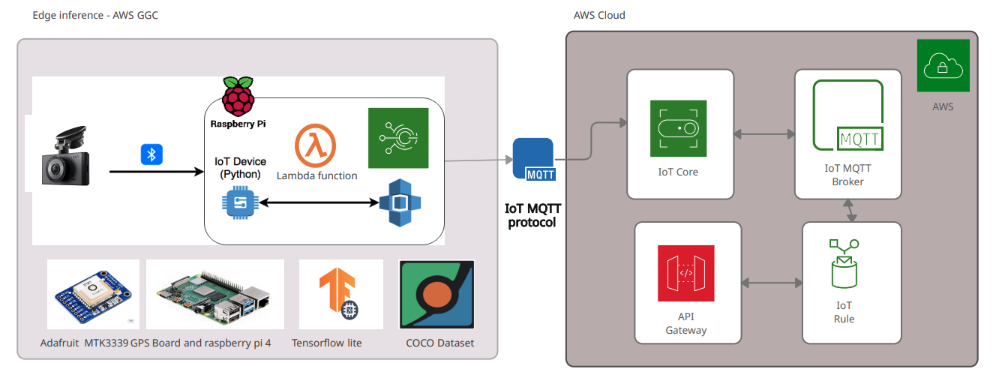
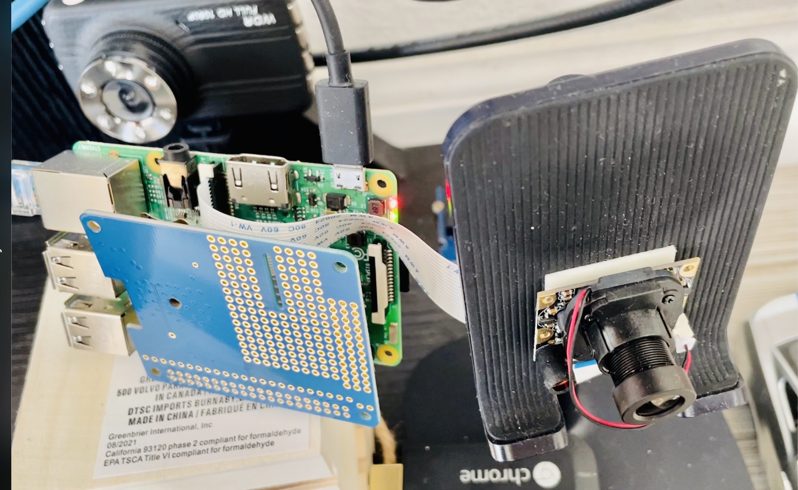
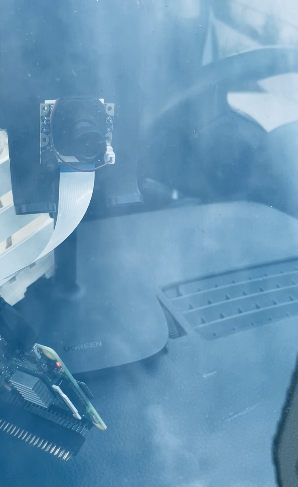

# IoTEdge - Traval flare

## IoTEdge Installation
1. update rasp to latest version

```
sudo apt-get update
sudo apt-get dist-upgrade
```
Make sure the camera interface is enabled in the Raspberry Pi Configuration menu.

2.  Download this repository and create virtual environment

```
git clone from repo
```

Then rename and get in dir
```
mv obj-detection tflite
cd tflite1
```

Install virtualenv by issuing:
```
sudo pip3 install virtualenv
```

Then, create the "tflite-env" virtual environment by issuing:
```
python3 -m venv tflite-env
```

activate the environment by issuing:
```
source tflite-env/bin/activate
```

3. Install TensorFlow Lite dependencies and OpenCV

To make things easier, use a shell script that will automatically download and install all the packages and dependencies. Run it by issuing:
```
bash requirements.sh
```

Then
```
sudo apt-get install libilmbase-dev
sudo apt-get install libopenexr-dev
sudo apt-get install libgstreamer1.0-dev
```

4. Set up TensorFlow Lite detection model

Download the sample model (which can be found on [the Object Detection page of the official TensorFlow website](https://www.tensorflow.org/lite/models/object_detection/overview)) by issuing:
```
wget https://storage.googleapis.com/download.tensorflow.org/models/tflite/coco_ssd_mobilenet_v1_1.0_quant_2018_06_29.zip
```

Unzip it to a folder called "Sample_TFLite_model" by issuing (this command automatically creates the folder):
```
unzip coco_ssd_mobilenet_v1_1.0_quant_2018_06_29.zip -d Sample_TFLite_model
```

5. Run the TensorFlow Lite model

python3 TFLite_detection_webcam.py --modeldir=TFLite_model

```

After a few moments of initializing, a window will appear showing the webcam feed. Detected objects will have bounding boxes and labels displayed on them in real time and tf flare util python process daemon start storing json file for accient data in json format for lamda to consume.
 ````
<p align="center">
   
</p>
<p align="center">
     
</p>
<p align="center">
  
</p>


